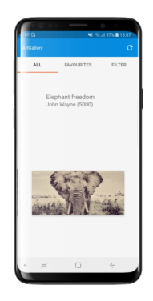
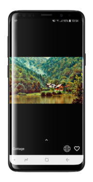
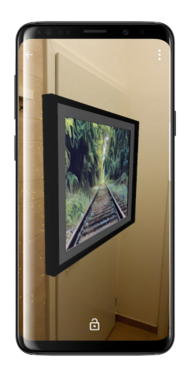

# ARCHIVED - Kentico Cloud Art Gallery Application for Android

 

> <h2 align="center">:warning:  Archive Notice</h2>
> This repository is no longer being maintained for compatibility with the latest version of the product. Examples in this repository refer to the previous product name, <strong>Kentico Cloud</strong>, rather than the new product name, <strong>Kentico Kontent</strong>.

Implementation of an art gallery application for Android written in Kotlin that utilizes Kentico Cloud CMS for content management. 
Register your account for free at https://app.kenticocloud.com.

With the ARCore platform, the application supports Augmented Reality and is able to create a virtual gallery within real environment.
Examples of how the app work can be seen [here](https://is.muni.cz/th/yabmm/videos.zip).

## Application Installation
1. Install [Android Studio](https://developer.android.com/studio/) and the latest Android SDK tools. 
2. Clone or download the repository into a chosen folder. 
3. Open the project in the IDE, let it install all the necessary libraries and tools. 
4. Building the project in Android Studio creates an `.apk` file, located in `app\build\outputs\apk\debug`.
5. The file can be used to install the application on a mobile device, but be sure to have one that [supports ARCore platform](https://developers.google.com/ar/discover/supported-devices).

## Looking for iOS?
[ Click here](https://github.com/Kentico/argallery-ios)
